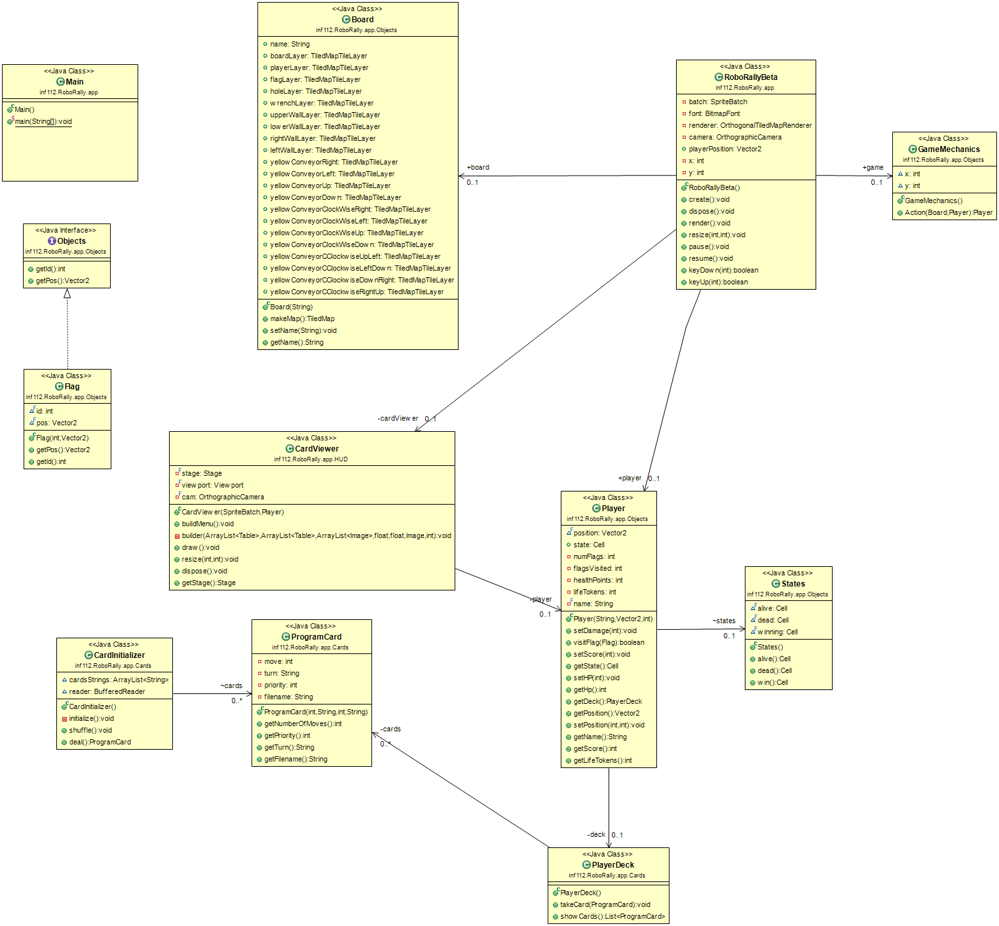

# Deloppgave 1:

## How does the roles in the team work? 
* Some of the roles sort of mix into eachother, and are done by more than one person
* Arild(rulekeeper) works very good. He has the answer to all we need of technical information about the game
* Both Alex and Tore program a lot of code to the branch. It works good that Tore lets Alex go over the code before it is pushed further
* Anders is not completely satisfied with his role, hasn't really come to an understanding of what a QA/tester actually do, 
  we have talked more about it and he will start with manually testing everything that can be manually tested.
* It is important that we test, and that the tests passes before they are pushed to main
* Junior and senior developers discusses the implementations and finds the best solutions
* Teamlead sets requirements og call for meetings, and looks after the progression.
* Teamlead should come a bit more terms with the project board
* QA writes issues to missing functionality

## What does the roles mean to us?
* Team lead sees everything through and makes sure everything is done when it should be done. Sets meetings and lets people know
* Costumer contact asks TA if there are something wrong or if they need help and explains about the project when needed
* Senior and Junior developer mainly takes care of the code, and help eachother to come up with the best solutions
* QA/tester has a responsibility to makes the tests are made and that they work and tell people they should test things if he don't have time himself
* Rulekeeper knows everything about the game and can answer everything the rest of the team wonders about rules and the way to play the game.
* We do not need any more roles atm, as we think the roles we have now fills all the holes we would need to fix.

## Retrospective
* Managed to have a lot of meetings and discuss strategies to find the best possible solutions
* Developed the code and program based on the plans discussed in the meetings
* Achieved a lot of what we wanted with the code
* We are very happy with the code associated to the cards, and how it is shown on the board

## Project methodology, good choices, what can be done better?
* The dynamic is good, we talk a lot and agree on everything
* We have good communication, show up to the meetings, and have several meetings outside of the mandatory ones.
* We use the Discord-channels a lot
* It works with the fact that only two people has main control over the code, and if someone sees a better solution they let them know
* We have managed to use Kanban and use the projectboard. The use of the projectboard can still improve though
* Everyone should get a routine to go in and check and move cards when starting or completing tasks. 
* Something new we want to try is to merge everything into the dev branch, before merging it into main so to see that nothing went wrong
* The group dynamic is good, we talk a lot and meet three times a week to catch up and see what needs to be done and so on
* We had way more effective meetings when we could meet physical and hope we can continue doing that.

## Committing code
* There are two main programmers, and they often stream for everyone to see when working on it so everyone takes part in the code
* Because of this senior and junior developers have a lot more commits than the rest of the group as they are responsible for the code going in and for choosing the best solutions represented by the group

## MVP's
* We have not completed two of the MVPs because we have focused on getting very good quality on the code associated to the code, and making the board look nice.
* We want high quality on the board and have therefore spent more time improving that, rather than finishing the rest of the code.

## Bugs
* Aspect ratio is wrong on Mac. The tecture is loaded wrong.
* The one card-graphic does not load properly on the one Linux-computer we have tested the game one. We are not sure if it is a local bug or not.

## Maximum three improvements for this sprint:
* Set clearer part-goals
* Everyone must get better at checking the projectboard everytime we start something new
* Get better at writing tests

## 
## To build and run the program, run the Main.java class in inf112.RoboRally.app.

# User stories:

* Playing from several computers: 
    * As a player I want to engage in a online game of RoboRally.
    * Acceptance Criteria:
        * I see the board
        * I see the other robots on the board
        * I see the game cards
        * I am in the same game as the players I am playing online with
    * Tasks:
        * Set up a TCP connection
        * Implement P2P
    
* Handing out cards
    * I need the cards to be dealt, for me to know my moves and to play
    * Acceptance Criteria:
        * I receive cards
        * I can see what my next move is
    * Tasks: 
        * Create a card class which makes the card
        * Create a method which divides the cards between the players
        * Create a method which lets the player draw cards
    
* Pick five cards
    * I need to be able to pick five cards to play the game
    * Acceptance Criteria:
        * I can decide which five cards I want to use from the cards I am dealt
    * Tasks: 
        * Create a method that shows me the cards I can pick from
        * Create a method that lets me choose the cards I want, up to five
    
* Moving the robot in the direction the cards tells me to
    * When I have put the cards in the order I want, I want to be able to move the robot accordingly. 
    * Acceptance Criteria: 
        * My robot moves in the direction mye first card says
        * After my robot has moved once, the card is thrown
    * Tasks:
        * Let the player choose what order to put the cards in
        * Make the robot what the card shows
    

