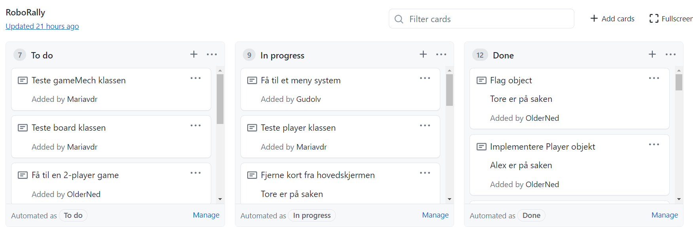

# Deloppgave 1:

## Does the roles in the team work?
* The roles work good, and all ambiguity that was raised in the beginning of the project is cleared up. Everyone is confident with their role in the project.
* Teamlead takes responsibility for the meetings and meeting minutes and for clearing up whatever is unclear at the time. Makes sure all the user stories applies and is put down on "paper"
* QA is taking responsibility for everything needed ot be tested and makes sure tests that do are not optimal or not in use are removed before the final commit.
* Senior and Junior developers comes up with a lot of good code and solutions for the most optimal solutions. They cooperate a lot with rulekeeper, which also contributes with a lot of good solutions to problems.
* Rulekeeper has everything under control regarding rules and makes sure the game is developed correctly according to the rules of the traditional board game, Roborally.

## Are there experiences worth mentioning reagarding the team or the teams method?
* The team works good, and we collaborate very well. We meet and talk several times a week, and you can see that we have progress in the project.
* Physical meetings work a lot better, faster is more effective. We still keep most meetings digital because the team has more time to meet then.
* It works good for the team to focus on one problem at a time considering that most of the meetings and lectures are digital, so we do not need to wonder what is going on since we do not yet trust the project board 100%.
* Playing multiplayer from several computers has taken a lot more time and is a lot more challenging than expected.
* We have now learned from about MVP and what it means and takes to satisfy and MVP. We have learned that time-demanding tasks should be started pretty early in the process. We chose to delay the most demanding task till the end, since we wanted 
  as much as possibly done early. For next time we know to start earlier on critical/demanding tasks. Despite pushing it, it has worked out fine.

## Does the team agree on the choices taken, and if not what could be improved?
* We have had a good dialog throughout the project, and the choices have been discussed with everyone that wished to take part.
* We have met several times a week to discuss potential problems and progress.  
* Whenever there has been a big issue, it has been discussed in the meetings with everyone to find a solution as quickly as possible.  
* We all agree on the choices we have done throughout.
* If there is something we would change it is starting earlier on the multiplayer part of the MVPs since it was a bigger task than first expected.  
* There has been a few cases where the tasks have been done in the last minute, which could have been avoided with a bit more planning.
* For the third sprint we should have everything ready at least a day before the deadline, so no one needs to work at night or right before the deadline to finish tasks.

## Communication
* Communication works good as we ask each other questions all the time, and talk several times a week. Everyone is comfortable asking whatever they are wondering, and I think it helped to have one physical meeting, where we could see who we were actually talking to. 
It has been easier to talk more after the physical meeting. 
* We often show each other code, or draw on the board if we meet physical to explain what we mean or to show something that might be new for someone in the group, but that we would like to use in the project. 
  
## Retrospective
* We planned from the beginning to use Kanban as our main method. We have also used pair-programming a lot, as well as remote programming, where one team-member shares their screen, tp get help on how to do the code.
  * We still use Kanban and project-board as a way to control what is being done and needs to be done next. Our plan was to focus on one thing at a time, but now that we have come further into the project
  we tend to work on more than one task at a time. The reason for this is that there is no need for 3 people to find out one thing, although it could be solved a little quicker. It is more efficient for some people to start on other parts of the project.
* __What have we managed to do until now?__
  * We have learned more about each others ways of working and routines, which make sit easier to know what to expect, and when to expect it.  
  * __MVPs__
    * We have finished all MVPs besides Multiplayer which was more work than first expected.
    * We have a working game which can be played single player at the moment.
    * We have implemented a main menu which needs to be improved
  * __What can be improved?__
    * The main menu
    * We wish to add sound effects to the game, and potentially music
    * We wish to have a built-in chat in the game as a simple way to communicate though the game.  
    * We will work on these things throughout the sprint 3, and hope to finish some of it until the deadline for mandatory assignment 3.
  * __How does the communication and cooperation work?__
    * The cooperation works good
    * Communication works good. 
    * We can still get better at moving things around in the project-board, but things are going well because we work on a lot together, and therefore know exactly what is being done at the moment.
  

## Maximum three points of improvement from the retrospective
* Creating issues for every little task.
* Create a more detailed plan for mandatory assignment 4, so nothing will be done in the last minute

## Prioritizing of the tasks
1. Finish the multiplayer
2. Main menu
3. Grid
4. Chat
5. Sound

## Demands
* We have updated our demands, how far we have come and prioritized the rest of our demands here.
  * Demands:
    1. Multiplayer
    2. Main menu
    3. Grid
    4. Sound and music
  * How far have we come since last?
    * We have really worked on the multiplayer and this is ready since the last assignment. 
    * We have also implemented more game methods, so soon you can play the game.
    * We have created a grid so that the player cannot go outside the board, since there is a wall there.
      The player can therefore not move outside the board. 
    * Improved how the controls are handled. 
    * We have improved the main menu and the screen.
  * Our focus from next week will be to implement sound effects and music in the game.

## Mvp-demands
__Changes in MVPs__
* We have focused on MVP 5: Multiplayer last of the mandatory demands.  
  * The reason for this is that the other tasks looked easier and more quickly to get out of the way. 
  * We had not taught ourselves enough about how to prioritize MVP-demands before-hand. If we knew what we know now about 
    how to prioritize MVPs, we probably would have started the Multiplayer-demand earlier.
  * Even though we did start in the wrong direction, everything is going well now, and we are happy about our progress. We have even get to started on our own MVPs, 
    and are hoping to be done with Multiplayer soon enough.
  
__What MVP do we find most important and why?__
* The most important MVP-demand for us is to show a game-board and to be able to move the game-piece so you can do something in the game
* Without a board or a game-piece there is not possible to anything in the game resembling to playing.

## Extra we want in the game if time
* Chat
* Lyd
* Main menu

## Bugs
* Render runs whenever the mouse moves on the screen, so it checks everytime the mouse-pointer is moving.

## Testing: Manual and automatic
* We have really focused on created more tests, both manual and automatic.

## Difference in committing
* Since we have different areas of the project we are responsible for, there is a difference in commits. 
* Tore and Alex have a lot more commits than the rest as they are responsible for committing the best solutions for everything.

## How to run the game on Windows, Mac and Linux OS.
Running the game on
* Windows:
  1. Go to our project-page on git: https://github.com/OlderNed/taco-laget, and clone the project to your computer
  2. Go to taco-laget/Robo Rally/src/main/inf112.RoboRally.app/Main
  3. Right click on Main and press "Run Main.main()"
  4. You will now see a game-board for our game
  5. Navigate the game-piece(UiB-owl) with the arrows on your keyboard
  6. To choose cards and use them, you simply click them with the mouse
  
* Mac OS:
  1. Go to the projects Github page at https://github.com/OlderNed/taco-laget
  2. Click on 'Code' and navigate down to 'Download as ZIP'
  3. Open IntelliJIDEA and open the downloaded project
  4. Navigate to Robo Rally/src/main/java/inf112.RoboRally.app
  5. Right click on 'Main' and select 'Run Main.main()'
  5b. If you get an error, find the 'Main' configuration on the top right corner of intellij(by the run button), click on 'Main' and click 'Edit configuration'.
     This should open up a new window called 'Run/Debug Configurations'
  5c. In 'Run/Debug Configurations' you should see a dropdown meny called 'Modify Options', click on 
     'Add VM options'. This adds another input field in 'Run/Debug Configurations'. Here you need
     to add '-XstartOnFirstThread'. Click 'Apply' and 'Ok' at the bottom right of the window.
  6. Find the run button on the top right of the intellij window and press it to run the project.
  7. You will now see a game-board for our game
  8. Navigate the game-piece(UiB-owl) with the arrows on your keyboard
  9. To choose cards and use them, you simply click them with the mouse
  
* Linux:
  1. Open Intellij
  2. go to 'file' and then 'new project from version control'
  3. Choose github, and then enter the URL, which is https://github.com/OlderNed/taco-laget
  4. Download the repo
  5. Navigate to Robo Rally/src/main/java/inf112.RoboRally.app
  6. Right click on the 'Main', and select 'Run Main.main()'
  7. You will now see a game-board for our game
  8. Navigate the game-piece(UiB-owl) with the arrows on your keyboard
  9. To choose cards and use them, you simply click them with the mouse
  
## Class diagram
* __Kommer med siste commit før innlevering__

## Projectboard

## User stories:
* Playing from several computers:
  * As a player I want to engage in a online game of RoboRally, so I can play with my friends.
  * Acceptance Criteria:
    * I see the board
    * I see the other robots on the board
    * I see the game cards
    * I am in the same game as the players I am playing online with
  * Tasks:
    * Set up a TCP connection
    * Implement P2P
  
* Checking if the robot is allowed to go a certain direction
  * As a player I want my robot not be able to go through walls, so I can play the game without cheating.
  * Acceptance Criteria:
    * I see a wall
    * I can not go through the wall
    * My robot stands still when hitting a wall
  * Tasks: 
    * Creating a grid
    * Deny the robot to walk on a object Wall
  
* Checking if a robot is moving outside the board
  * As a player I want my robot not to go outside the board, so I see my robot at all times
  * Acceptance Criteria: 
    * I see the board
    * I see my robot on the board constantly
    * If I stand on the edge of the board, my robot won't go further out
  * Tasks:
    * Using for-loops to check if the robot is trying to move outside the board
  
* Implementing a main menu
  * As a player I want to be able to choose whether I want to play multiplayer or single and other settings before playing, so I can play how I prefer
  * Acceptance criteria:
    * I see a main menu with different choices
    * I can choose the settings in the menu I prefer
  * Tasks: 
    * Implement a main menu
    * Include settings that a player would want to decide for themselves

  
  
